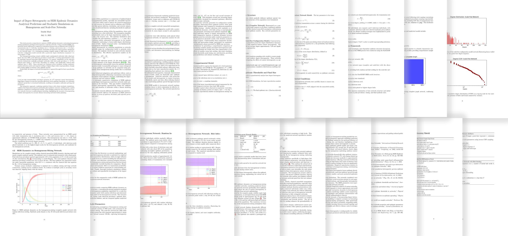

[](LICENSE)
[](https://github.com/KSUNetSE/EpidemIQs)
[](https://github.com/KSUNetSE/EpidemIQs/commits/main)
[](https://github.com/KSUNetSE/EpidemIQs/issues)
<div align="center">
 <p> </p>
 <h1>  Prompt‑to‑Paper LLM Agents for Epidemic Modeling and Analysis<h1> 
</div>

---
## Project Overview
A multi‑agent LLM framework that can execute an end‑to‑end designed scientific workflow autonomously for network‑based epidemic modeling; from literature discovery and analytical derivations to stochastic simulation, analysis, and LaTeX manuscript generation.

- **Core Idea:** Orchestration of two agent types, *scientist* and *task‑expert*, in five teams to complete the five main scientific phases: **Discovery → Modeling → Simulation → Analysis → Report**.

- **Backbone Models:** We focused on OpenAI models such as: `gpt‑4.1` (Scientists), `gpt‑4.1‑mini` (Experts), `o3‑mini` for MathExpert.  You can use other models from xAI, Anthropic, and Google as long as the model can support tool calling and generation of structured outputs. Ensure you have added  API keys in the .env file.
- We also have tested gpt-4o and grok-3, results are in experiments folder. We advise do not use models with reasoning as Scientists, it seems they do no follow the instructions well! 
- **Simulation Engine:** The `SimulationScientist` has access to [FastGEMF](https://github.com/KSUNetSE/FastGEMF) to perform multi-spread over complex multilayer spread simulations.

- **Highlights:** Low cost per study, full pipeline completion(automous and copilot), final report based on mutlimodal-multisource artifacts generated or retrieved through pipelines

- **Scope:** Our work is currently only for network-based epidemic modeling. We are actively working on a newer design to support a wide variety of methods in the future, having ideazation and getting closer to autonomous research.
---

<div align="center">
  <h1> Example of generated report by EpidemIQs</h1>
 <p> </p>
</div>

- For detailed examples of the generated results, along with the reports, please see `experiments` folder in this repo


---

##  Features
-  **Multi‑agent orchestration** with structured outputs (Pydantic models) and reflection loops.
-  **Agentic retrieval** (web + literature) feeding math reasoning and code generation.
-  **Network‑aware simulations** on multilayer graphs with FastGEMF.
-  **Autonomous analysis** (numeric + visual) with metric extraction.
-  **Auto‑reporting** to LaTeX/PDF with compile/repair pass.


## Installation (with `uv`) and Quick Start
```bash
# 1) Ensure Python > 3.10
# 2) go to your desired directory and clone the repo
git clone https://github.com/KSUNetSE/EpidemIQs.git
# go to the repo directory
cd EpidemIQs  
# 3) create and activate venv
python -m venv .venv 
source .venv/bin/activate # for macos, for windows use: .venv\Scripts\activate  

# 4) install dependencies
pip install -e .

#5) edit the config and pass it the epidemIQs in command line
epidemiqs run now  --config config.yaml    
```

##  API Configuration
the only need you need to modify to run EpidemIQs are .env (for API keys) and config.yaml (for configuration the setup) as follows:
```toml 
## .env
#Ensure you have inserted the following API keys:

semantic_scholar_key = "<PLACEHOLDER>"        # API key for fetching scientific papers -NEEDED
tavily_key           = "<PLACEHOLDER>"        # API key for Tavily search integration -NEEDED
openai_key           = "<PLACEHOLDER>"        # API key for OpenAI model access -NEEDED
```
If you rather to use Grok, GEMINI or anthropic models ensure that you have their API KEYs
```
GROQ_API_KEY=gsk_...
XAI_API_KEY=xai-...
GEMINI_API_KEY=AIza...
ANTHROPIC_API_KEY=sk-...
```

---

### Fast  reproduce of  the ten evaluation scenarios
```bash
#1) for question 1: effect of degree  heterogeneity of contact network on spread process
epidemiqs run now  --config questions/question-1-config.yaml    

#2) for question 2: reasons for break of chain of transmission     
epidemiqs run now  --config questions/question-2-config.yaml    

#3) for question 3: Temporal effect of spread vs static aggregation
epidemiqs run now  --config questions/question-3-config.yaml    

#4) for question 4: Coexistence of exclusive bivirus spread over multilayer networks
epidemiqs run now  --config questions/question-4-config.yaml  

#5)  for question 5: Vaccination threshold for herd immunity
epidemiqs run now  --config questions/question-5-config.yaml 
#6-10) For other questions use, configs 6 to 10 in the questions folder.                                                                                             
```
> Outputs: CSVs, plots (PNG), network files (NPZ), logs (JSON), and `report.pdf` in each run directory.

---


### `config.yaml` (Experiment Configuration)

```yaml
query: "How can latent period affect epidemic behavior spread?"                 # Main research or query prompt
name: "experiment-1"                          # Unique experiment identifier (used in file naming)

workflow:
  copilot: False                              # enables/disables copilot mode for assisted generation
  scientist_modules:                          # defines the scientist’s workflow components
    plan: True                                # enables planning phase (reasoning steps)
    reflect: True                             # enables reflection phase (model self-evaluation)
  reflection_max_iters: 1                     # maximum number of reflection cycles (too high may slow down)
  no_retries: 10                              # maximum retries before giving up on valid structured output
  no_paper_revise: 0                          # number of paper revision rounds (increase only if needed)
  time_out_tools: 180                         # default timeout for tool execution in seconds

llm:
  scientists:
    provider: openai                # LLM provider (e.g., openai, grok)
    model: gpt-4.1                  # Scientist model for main reasoning and generation

  experts:
    provider: openai
    model: gpt-4.1-mini             # Expert model for faster clarifications or validations

  mathematician_expert:
    provider: openai
    model: o3-mini                 # specialized model for mathematical or analytical reasoning

  vision_expert:                   # make sure the model supports vision inputs!!!
    provider: openai
    model: gpt-4.1-mini

paths:
  output_dir: where/to/save/outputs           # output directory for results
  contact_network_path: optional/path/to/contact_network_file  # Optional path for network or simulation input
```

---

This configuration controls how **EpidemiQS** runs experiments, manages model roles, and stores outputs.
It separates **scientific reasoning**, **expert validation**, and **mathematical analysis** into distinct model roles,
allowing reproducible, modular, and configurable workflows.


---
##  Architecture
```
User Query → Discovery → Modeling (Network|Model|Params) → Simulation →   Analysis →   Report
               ↑               ↑                               ↑               ↑           ↑    → project repo and final PDF report
         Online/Lit/Math   Network/Model/Param          FastGEMF runs    Data/Vision   LaTeX
```
- **Agent types:**
  - **Scientist agents:** Planning, ReAct, reflection, tool selection, quality control.  
  - **Task‑expert agents:** Atomic focused agents operate as tools (OnlineRetriever, LiteratureRetriever, MathExpert, Vision/Data Expert, ReportWriter/LatexCrafter).
- **I/O:** All artifacts written to a versioned run directory under `./output/<run_id>/…`.


---

## Repository Layout
```
epidemiqs/
├── experiments/                 #  Generated results for different queries and configs.    
├── images/                      
├── output/                      #  this is the folder wher agents store and retrieve data and artifacts, do not add files here. 
├── questions/                   #  predefined epidemic questions for easy testing
├── benchmark_results/           #  benchmark of different Scientist architectures over DSBench.
├── src/                         #  Core application source code.                            💻
│   ├── epidemiqs/               #  package root
│   │   ├── __pycache__/
│   │   ├── agents/              #  core agent definitions (Scientists, Experts, etc.).
│   │   ├── cli/                   
│   │   └── utils/               
│   └── tests/                   
├── .env                         #  OpenAI,TavilyAPI, and SementicScholar are NEEDED!        🔑
├── .gitignore                    
├── pyproject.toml               
├── README.md      
├── config.yaml                  # configure this config and pass it to EpidemIQs to run your query               
└── LICENSE.md                   
```

---
## Usage Policy

This project is released **for research and academic purposes only**.

By using this repository, you agree to the following conditions:

- **No watermark removal**: Any reports, figures, or documents generated by this framework contain mandatory watermarks indicating AI-generated content. **Removing, altering, or obscuring these watermarks is strictly prohibited**.
- **No authorship claims**: Outputs generated by this system must not be presented as original human-authored scientific work.
- **Error-prone results**: Generated results, analyses, and conclusions may contain methodological, numerical, or logical errors. **All outputs require independent human verification before any use**.
- **No misuse**: This framework is intended as a research prototype and proof of concept, not as a decision-making or production system.

Use of this repository implies acceptance of these conditions.

---


##  Data & Artifacts
- **Networks:** Saved as `.npz` (adjacency / edge lists + metadata).  
- **Results:** Time‑series CSVs (`S,E,I,R…`), .npy, metrics JSON (peaks, sizes, durations).  
- **Plots:** Matplotlib PNGs per scenario.  
- **Reports:** `paper.pdf` with LaTeX sources.


---

##  Simulation Engine (FastGEMF)
- **Purpose:** Efficient CTMC simulations for arbitrary multi‑compartment processes on multilayer networks.
- **Limitations:** Temporal networks require a dedicated engine (documented fallback).


---


---

## Evaluation
- **LLM‑as‑Judge:** Overall quality score distribution and rubric.  
- **Human Review:** Mean ± sd across criteria (readability, relevance, soundness, rigor, ethics).  
- **Compute & Cost:** Tokens, wall‑time, $ per run.


##  How to Cite
```
@article{samaei2025epidemiqs,
  title={EpidemIQs: Prompt-to-Paper LLM Agents for Epidemic Modeling and Analysis},
  author={Samaei, Mohammad Hossein and Sahneh, Faryad Darabi and Cohnstaedt, Lee W and Scoglio, Caterina},
  journal={arXiv preprint arXiv:2510.00024},
  year={2025}
}
```

---


##  Roadmap
```
- [ ] Broaden to ABM/IB Ms and statistical pipelines.  
- [ ] Full‑paper deep retrieval (PDF parsing & table extraction).  
- [ ] Data-driven forecasting abaility 
- [ ] Memory distillation & long‑run reproducibility suite.  
- [ ] Better LaTeX lint/repair and figure referencing.

---
```
##  Ethics & Limitations
```
- **Human oversight required.** Agents can make persuasive errors. 
- **Risk of Hallucination:** We detect hallucinated references in the reports. Ensure to double check the results. 
- **Retrieval faithfulness:** Guard against hallucinated references.  
- **Sensitive domains:** Follow biosafety & data‑use policies.  
- **Known issues:** Occasional analysis misreads; see Troubleshooting.
```
---


